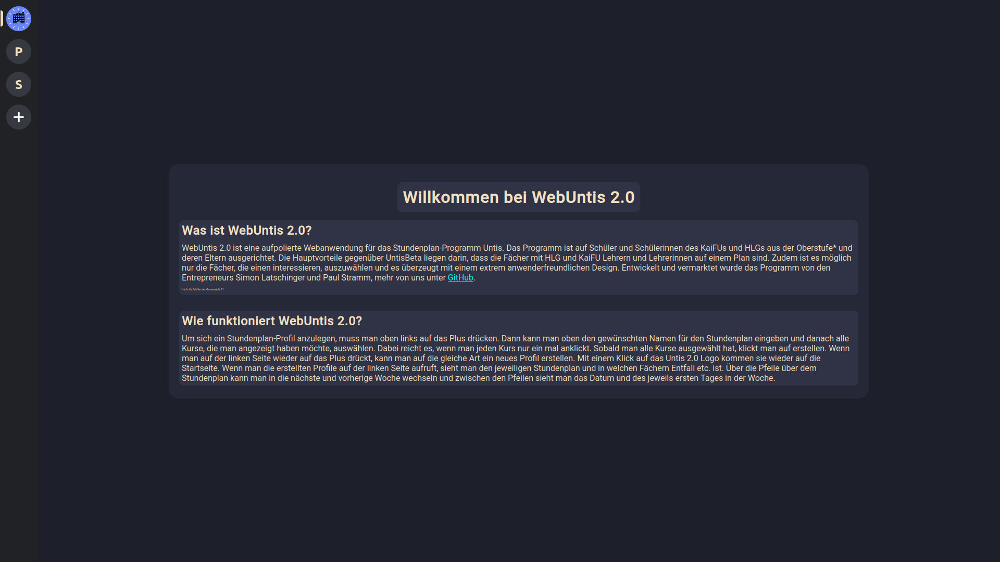
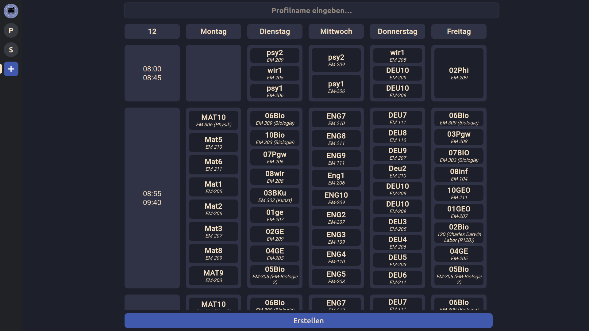
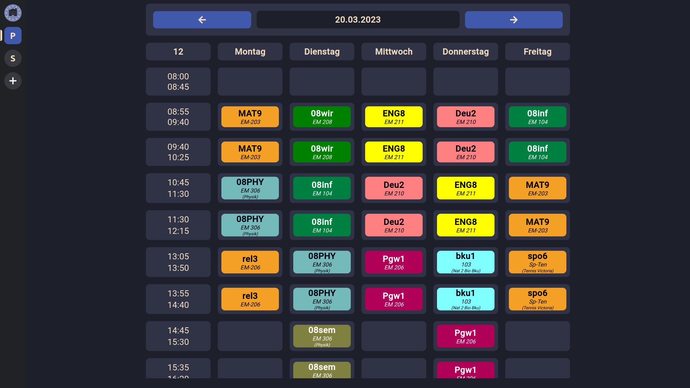

# Untis 2.0

Dies ist unser jüngstes Projekt (außer wir haben ein neues). Es heißt Untis 2.0 und der Name sagt eigentlich das meiste. Das Ziel von mir und meinem Geschäftspartner ist es eine Webanwendung und eine App Version von Untis zu kreieren, die für uns in der Oberstufe besser ist. Uns nervt zum Beispiel, dass für jede Stunde alle Kurse angezeigt werden und nicht nur die, die wichtig für einen sind. Und wenn man genervt ist, dann ist das nicht gesund und deswegen basteln wir ein verbessertes Untis.
---
 
 

# Wie funktioniert WebUntis 2.0?
Wenn man zunächst aufruft WebUntis 2.0 stehen zwei Funktionen zur Verfügung. Man wird zunächst von der [Homepage](#homepage) begrüßt, die in Zukunft unter dem Icon   zu finden ist.
 
Desweiteren kann unter dem Plus-Zeichen ein [neues Profil](#profil-erstellen) erstellt werden: .
Auch sind die bereits erstellten Profile hier zu finden, welche den ersten Buchstaben des Namens des Profils anzeigen:  .
 

# Homepage

 
 

# Profil erstellen

 
 

# existierendes Profil
